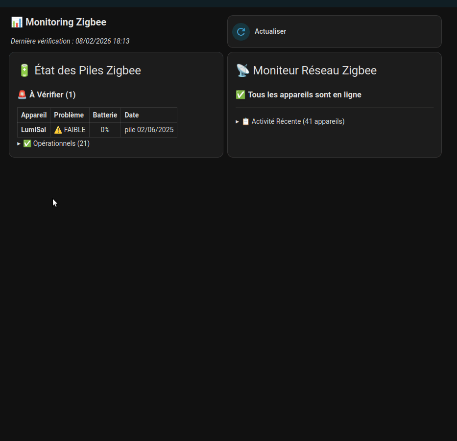
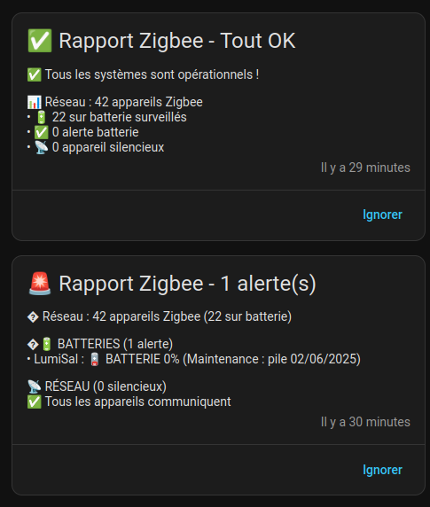

# Surveillance des Batteries Zigbee (Zigbee2MQTT)

Ce projet permet de surveiller l'état de santé de tous vos appareils Zigbee sur batterie. Il croise les données de **Zigbee2MQTT** (pour les métadonnées comme les dates de changement de pile) avec les états de **Home Assistant** (pour le niveau de pile et la disponibilité).

---

## 📑 Sommaire

| Section | Description |
|---------|-------------|
| [📂 Structure du Projet](#-structure-du-projet) | Liste des fichiers |
| [⚠️ Pré-requis MQTT](#️-pré-requis-important--topic-mqtt) | Configuration du topic |
| [🛠️ Installation](#️-installation--configuration) | 3 méthodes d'installation |
| [⚙️ Fonctionnement Technique](#️-fonctionnement-technique) | Explication des capteurs |
| [📊 Cartes Dashboard](#-cartes-dashboard) | Affichage visuel |
| [🤖 Automatisation](#-automatisation--rapport-journalier) | Notifications et rapports |
| [🧪 Comment Tester](#test-1--simuler-une-alerte-outils-de-développement--états) | Tests et debug |
| [🔧 Compatibilité](#-compatibilité) | Corrections appliquées |

---

## 📂 Structure du Projet

```
monitoring-zigbee/
├── method_package/                  # OPTION A : La Méthode "Package" (Recommandée)
│   └── zigbee_monitoring_package.yaml # Tout-en-un (Sensors + Automation)
│
├── method_template/                 # OPTION B : La Méthode "Classique" (yaml séparés)
│   ├── zigbee_sensors.yaml          # Capteurs (inventaire, alertes, réseau)
│   ├── zigbee_report.yaml           # Automation standard (Notification HA)
│   └── zigbee_report_perso.yaml     # Automation personnalisée (Exemple complexe)
│
├── dashboard_unified_grid.yaml      # Carte Dashboard (Commune aux 2 méthodes)
├── archive/                         # Anciens fichiers
└── README.md                        # Ce fichier
```

## ⚠️ Pré-requis Important : Topic MQTT
Les fichiers (Package ou Template) sont configurés par défaut avec un topic spécifique : **`zigbee2mqtt02`**.
```yaml
- trigger:
    - platform: mqtt
      topic: zigbee2mqtt02/bridge/devices  <-- VÉRIFIEZ CE TOPIC !
    - platform: mqtt
      topic: zigbee2mqtt02/+              <-- ET CELUI-CI AUSSI !
```
Si votre installation Zigbee2MQTT utilise le topic par défaut (`zigbee2mqtt`), **vous devez modifier ces 2 lignes** avant l'installation pour mettre : `zigbee2mqtt/...`.

## 🛠️ Installation & Configuration

Pour installer ce projet, choisissez **UNE SEULE** des 2 méthodes ci-dessous.

### 🌟 Méthode 1 : Le Package (Recommandée)
C'est la plus simple : un seul fichier à gérer.

1. Vérifiez que vous avez ceci dans `configuration.yaml` :
```yaml
homeassistant:
  packages: !include_dir_named packages
```
2. Créez le dossier `/config/packages/` s'il n'existe pas.
3. Copiez le fichier `method_package/zigbee_monitoring_package.yaml` dedans.
4. Redémarrez Home Assistant.

> [!WARNING]
> **Limitation de l'édition** : Les automatisations incluses dans un package sont **en lecture seule** dans l'interface graphique de Home Assistant.
> Si vous voulez modifier l'heure du rapport ou le message, vous devrez éditer directement le fichier `method_package/zigbee_monitoring_package.yaml`.
> 
> **Astuce** : Vous pouvez cliquer sur le bouton **"Migrer"** (dans le bandeau jaune) pour déplacer cette automatisation vers `automations.yaml`. Cela la rendra modifiable via l'interface, mais elle ne sera plus liée au fichier du package.

### ⚙️ Méthode 2 : Les Fichiers "Split" (Avancé)
Si vous préférez séparer vos capteurs et vos automatisations (méthode classique).

**1. Les Capteurs (`zigbee_sensors.yaml`)**
Copiez `method_template/zigbee_sensors.yaml` via votre méthode habituelle (soit dans `configuration.yaml` sous `template:`, soit dans votre dossier `templates/`).

**2. L'Automatisation (`zigbee_report.yaml`)**
Copiez le contenu de `method_template/zigbee_report.yaml` dans une nouvelle automatisation (mode YAML) ou dans votre fichier `automations.yaml`.

**3. Redémarrez Home Assistant.**

## ⚙️ Fonctionnement Technique

### 1. Le Capteur Maître (`sensor.z2m_battery_devices`)
Ce capteur écoute **deux sources MQTT** :
1.  `zigbee2mqtt02/bridge/devices` : Pour l'inventaire complet des appareils (déclenché rarement).
2.  `zigbee2mqtt02/+` : Pour le trafic temps réel (mise à jour de l'attribut `last_seen_registry`).

- **État** : Nombre total d'appareils sur batterie détectés.
- **Attributs clés** :
    - `last_seen_registry` : Dictionnaire stockant l'heure de dernier passage de chaque appareil qui "parle".
    - `devices` : Liste enrichie des appareils sur batterie (nom, statut, pile, date maintenance).
    - `raw_devices` : Données brutes de l'inventaire Z2M.

### 2. Le Capteur Réseau (`sensor.z2m_network_monitor`)
Ce capteur analyse `last_seen_registry` pour détecter les appareils "silencieux" depuis trop longtemps.

> [!NOTE]
> **Pourquoi un trigger `time_pattern` (toutes les 15 min) ?**
> L'attribut `last_seen_registry` est mis à jour à **chaque message MQTT** (potentiellement des centaines par minute).
> Sans ce timer, le capteur recalculerait inutilement à chaque message reçu, gaspillant des ressources.
> Le délai de 15 minutes est un bon compromis entre réactivité et performance.

### 3. Le Capteur Qualité Signal (`sensor.z2m_lqi_monitor`)
Ce capteur analyse la qualité du signal (LQI - Link Quality Indication) de chaque appareil qui communique.

- **Seuil "faible"** : `< 30` (configurable dans le code).
- **Mise à jour** : Toutes les 15 minutes.
- **But** : Affichage visuel uniquement dans le Dashboard (pas d'alerte).

### 4. Le Capteur d'Alertes (`sensor.zigbee_battery_alerts`)
Ce capteur filtre la liste du capteur maître pour ne sortir que les appareils nécessitant une intervention humaine.

**Critères d'alerte :**
- Appareil marqué `offline`.
- Niveau de batterie `< 15%`.
- Niveau de batterie inconnu (`?`).

## 📋 Comment tenir à jour les dates ?
Pour que la date de changement de pile s'affiche :
1. Allez dans l'interface **Zigbee2MQTT**.
2. Cliquez sur un appareil > **Settings** (Paramètres).
3. Dans le champ **Description**, écrivez par exemple : `pile 02/02/2026`.
4. Le capteur se mettra à jour automatiquement à la prochaine publication du bridge.

## 🔄 Comment forcer une actualisation ?

Un bouton **"Actualiser Monitoring Zigbee"** est créé automatiquement via le fichier `zigbee_sensors.yaml`. Il est intégré directement dans les cartes Dashboard fournies.

En cliquant dessus, vous forcez le recalcul immédiat des **deux capteurs** :
- `sensor.z2m_battery_devices` (inventaire et batteries)
- `sensor.z2m_network_monitor` (appareils silencieux)

Vous pouvez vérifier l'action en observant l'attribut `last_check` qui change à chaque appui.

> [!NOTE]
> **Après un redémarrage de Home Assistant**, il est normal que beaucoup d'appareils apparaissent en "INCONNU" ou "0%" pendant quelques minutes.
> C'est le temps que Home Assistant rétablisse la connexion avec tous les capteurs (qui peuvent être en veille).
> Une fois le système stabilisé, un clic sur le bouton "Actualiser" remettra tout d'équerre.

### Dashboard Unifié (Vue "Sections")
Fichier : `dashboard_unified_grid.yaml`

Cette carte regroupe **Batteries + Réseau + Bouton Actualiser** en une seule grille optimisée.

**Installation Spécifique "Vue Sections" :**
1. Créez une nouvelle Section dans votre dashboard.
2. Cliquez sur le crayon (Editer) de la section.
3. Passez en éditeur YAML (souvent via les 3 points ou "Afficher l'éditeur de code").
4. Collez l'intégralité du contenu de `dashboard_unified_grid.yaml`.




> [!NOTE]
> Les anciennes cartes séparées (`dashboard_card.yaml`, `dashboard_network_card.yaml`, etc.) ont été déplacées dans le dossier `archive/` pour clarté.

## 🤖 Automatisation : Rapport Journalier

Deux versions sont disponibles :

| Fichier | Description |
|---------|-------------|
| `zigbee_report_simple.yaml` | **Recommandé** - Notification persistante HA (aucune dépendance) |
| `zigbee_report.yaml` | Version perso avec K-2SO, Discord et Awtrix |

### Version Simplifiée (`zigbee_report_simple.yaml`)

Utilise uniquement les **notifications persistantes** de Home Assistant.

| Trigger ID | Quand ? |
|------------|---------|
| `scheduled` | Tous les jours à 20h00 |
| `battery_alert` | Dès qu'une batterie passe sous le seuil |
| `network_alert` | Dès qu'un appareil devient silencieux |

**Installation :**
1. Copiez le fichier dans votre dossier `automations/` ou collez le contenu dans l'éditeur d'automatisation.
2. Rechargez les automatisations.



### Test 1 : Simuler une alerte (Outils de développement > États)

1. Allez dans **Outils de développement > États**
2. Cherchez `sensor.zigbee_battery_alerts` ou `sensor.z2m_network_monitor`
3. Changez l'état de `0` à `1`
4. Cliquez **"Définir l'état"**
5. L'automation devrait se déclencher immédiatement → notification persistante créée

### Test 2 : Exécuter l'automation manuellement

1. Allez dans **Paramètres > Automatisations**
2. Trouvez "Zigbee : Rapport Journalier (Simplifié)"
3. Cliquez sur les 3 points > **Exécuter**
4. Vérifiez la notification persistante créée

### Test 3 : Vérifier le cas "Tout OK"

1. Dans **Outils de développement > États**, mettez les deux sensors à `0` :
   - `sensor.zigbee_battery_alerts` = `0`
   - `sensor.z2m_network_monitor` = `0`
2. Exécutez l'automation manuellement (voir Test 2)
3. Vous devriez recevoir une notification "✅ Rapport Zigbee - Tout OK"

> [!TIP]
> Les notifications persistantes s'empilent (elles ne se remplacent pas).
> Pour les effacer, cliquez sur "Ignorer" ou allez dans **Notifications** de HA.

